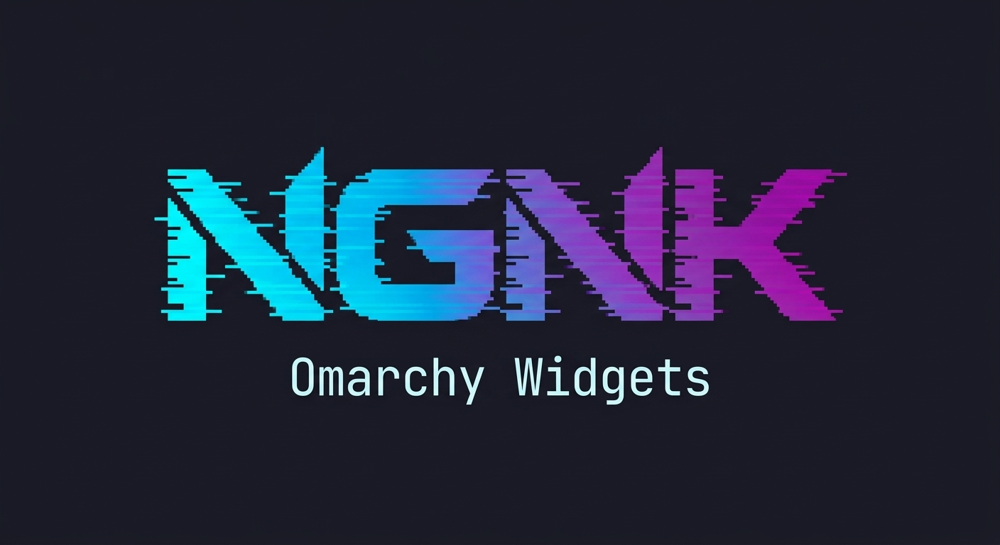
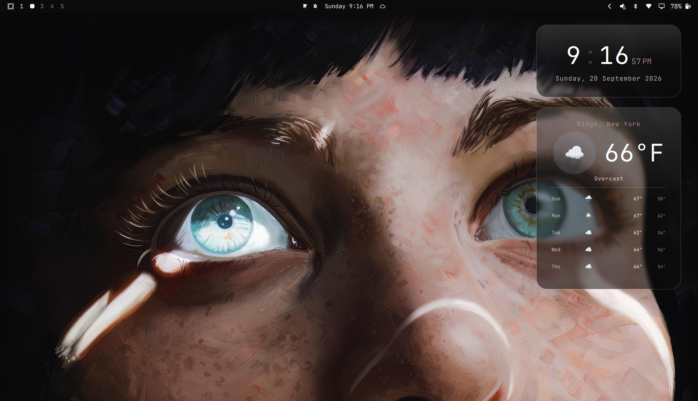

# Glass Weather

<p align="center">
  
</p>

A frosted-glass weather widget for [Omarchy](https://omarchy.org), styled to
match the [Glass Clock](https://github.com/indibyte/NGNK-glass-clock).



Renders a translucent, blurred panel on the right edge of your primary display,
stacked below the Glass Clock. Click the panel to search for a city; the widget
autocompletes matches live from [Open-Meteo](https://open-meteo.com) (geocoding +
forecast, no API key required).

## Features

- Frosted-glass panel with sheen and shading gradients that follows your theme
  colors, corner radius, and gaps
- Current weather: colorful condition icon, temperature, condition label, and
  location
- 5-day forecast with per-day weather icons and high/low temperatures
- Temperature unit (°C/°F) chosen automatically from the selected location
  (Open-Meteo `country_code`: US, LR, and MM use Fahrenheit)
- Click-to-edit city selector: type and pick from live Open-Meteo search results
  (`geocoding-api.open-meteo.com/v1/search`), with Up/Down or click to choose and
  Enter to confirm; click anywhere outside to dismiss
- Location persists to `~/.config/omarchy/glass-weather.json` (kept outside the
  plugin folder so the shell's plugin watcher never loops on it)
- Auto-refreshes every 30 minutes and on Hyprland `configreloaded`
- Falls back to a higher-opacity tinted panel when Hyprland blur is disabled

## Install

Prefer the native Omarchy command:

```bash
omarchy plugin add https://github.com/indibyte/NGNK-glass-weather --enable --yes
```

Or copy/symlink this directory into your Omarchy plugins folder:

```
~/.config/omarchy/plugins/ngnk.glass-weather/
```

Requires `curl` on PATH for the weather/geocoding requests.

## Usage

1. Enable the plugin in your Omarchy config (id: `ngnk.glass-weather`).
2. Restart the Omarchy shell (`omarchy restart shell`).
3. Click the panel, type a city name, and pick a result (or press Enter for the
   top match). The editor is an overlay panel that grabs keyboard focus only
   while open.

The widget appears pinned to the right edge of your primary monitor, directly
below the Glass Clock.

## License

[MIT](LICENSE)
